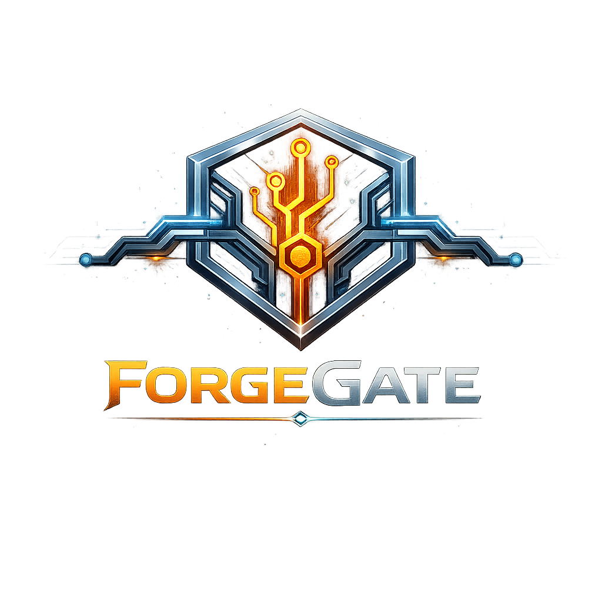

# ForgeGate — Smart AI Gateway for Every Model


<p align=center></p>
ForgeGate ist ein **docker-first Smart AI Gateway**, das **Gateway, Harness und Control Plane** in einer Plattform vereint.

Das Ziel: **AI-Provider, Modelle und Clients einheitlich anbinden, verwalten, testen, überwachen und nutzen** — ohne für jeden neuen Anbieter ein separates Zwischentool bauen zu müssen.

## Was ForgeGate ist

ForgeGate ist die Schicht zwischen:

- **AI-Providern**
- **lokalen Modellen**
- **OAuth-/Account-basierten AI-Diensten**
- **OpenAI-kompatiblen Clients**
- **Admin- und Betriebsoberflächen**

ForgeGate soll nicht nur Requests durchreichen, sondern eine echte **Integrations-, Betriebs- und Observability-Plattform** für AI-Zugänge werden.

## Wofür ForgeGate gebaut wird

ForgeGate soll als Beta folgende Hauptrollen erfüllen:

### 1. Smart AI Gateway
Einheitlicher Zugriff auf verschiedene AI-Modelle und Provider über eine möglichst kompatible OpenAI-Schnittstelle.

### 2. Harness für Provider-Integration
Neue Anbieter, Templates, Profile und Modellquellen sollen über ForgeGate angebunden, getestet und diagnostiziert werden können.

### 3. Control Plane für den Betrieb
Admins sollen Provider, Profile, Runs, Syncs, Errors, Health, Kosten und Auffälligkeiten zentral im UI sehen und steuern können.

---

# Zielbild

## Einheitliche Runtime
ForgeGate soll für Clients möglichst wie ein **OpenAI-kompatibler Endpoint** wirken, inklusive:

- Chat Completions
- Model Listing
- Streaming
- Fehlernormalisierung
- Routing
- Observability
- Kosten- und Health-Sicht

## Provider Harness
ForgeGate soll einfache, exotische und nur teilweise kompatible Anbieter **ohne Extra Tool** integrieren können durch:

- Templates
- Provider-Profile
- Preview
- Verify
- Dry-Run
- Probe
- Discovery
- Sync
- Inventory
- Run-Historie
- Snapshot-Sichten

## Operative Control Plane
ForgeGate soll eine echte Arbeitsoberfläche für den AI-Betrieb bieten:

- Provider-Verwaltung
- Harness-Profile
- Modellinventar
- Sync-/Discovery-Status
- Runs / Historie
- Health-Steuerung
- Fehlerachsen
- Kosten- und Usage-Sichten
- Client-/Consumer-/Integration-Operational-View
- Needs-Attention- und Alert-Signale

---

# Beta-Zielbild für Anbindungen

ForgeGate-Beta soll diese Anbindungsachsen ausdrücklich enthalten:

## OAuth- / Account-Provider
- OpenAI Codex
- Gemini
- Antigravity
- GitHub Copilot
- Claude Code

Für diese Provider sind im Zielbild relevant:

- Auth-/Credential-Modell
- Readiness-/Health-Semantik
- Verify-/Probe-Achse
- Runtime-Anbindung
- Fehler-/Observability-Achse
- UI-/Control-Plane-Sicht

## Sonstige Cloud-Provider
ForgeGate soll eine **möglichst kompatible OpenAI-Schnittstelle** für sonstige Provider bieten, damit viele OpenAI-ähnliche Dienste **ohne separates Zwischentool** angebunden werden können.

## Lokale Provider
ForgeGate soll im Beta-Zielbild eine **dedizierte Ollama-Anbindung** enthalten.

## Client-Kompatibilität
ForgeGate soll für Tools und Clients eine **möglichst kompatible OpenAI-Schnittstelle** bereitstellen.

---

# Wichtige Produkt-Features

## Runtime & Routing
- Einheitlicher AI-Zugang
- Provider-Routing
- Modellkatalog
- Streaming
- Health-/Readiness-Prüfung
- Fehlernormalisierung

## Harness
- Provider-Templates
- Profile
- generische Integrationen
- Mapping für Request / Response / Error / Stream
- Preview / Verify / Dry-Run / Probe
- Discovery / Sync / Inventory
- Snapshot- und Run-Historie

## Observability
- Fehler pro Provider
- Fehler pro Modell
- Fehler pro Profil / Integration
- Fehler pro Client / Consumer / Verbindung
- Trends und Zeitfenster
- Runtime- vs. Health-Check-Traffic
- Kostenachsen:
  - actual
  - hypothetical
  - avoided

## UI / Control Plane
- Provider- und Profilverwaltung
- Modellinventar
- Sync-/Discovery-Steuerung
- Run-Historie
- Client-Ops-Sicht
- Kosten- und Usage-Sichten
- Dark Mode / Light Mode
- Dark Mode als Standard

## Deployment
- Docker-first
- ein ForgeGate-Container
- ein PostgreSQL-Container
- Frontend im ForgeGate-Container integriert
- Betrieb per Docker Compose
- später Bootstrap-/Installer-Routine für Anwender

---

# Architekturprinzipien

ForgeGate wird **from scratch** aufgebaut.

Wichtige Regeln:

- `reference/` ist nur Referenzmaterial
- keine produktiven Imports aus `reference/`
- keine versteckte Altcode-Portierung
- Semantik wird neu, kontrolliert und produktorientiert umgesetzt
- maximale Produktsubstanz vor unnötiger Verhärtung

---

# Aktueller Fokus

ForgeGate befindet sich im fortgeschrittenen Aufbau Richtung Beta.

Aktuelle Schwerpunkte sind:

- PostgreSQL-basierte Produktreife
- docker-first Deployment
- Harness-Lifecycle
- Discovery / Sync / Inventory
- operative Control-Plane-UI
- OpenAI-Kompatibilität
- Provider- und OAuth-Zielbild für Beta

---

# Repository-Struktur

```text
forgegate/
  backend/      # Runtime, Admin, Harness, Provider, Storage
  frontend/     # Control Plane UI
  docker/       # Compose / Container-Setup
  scripts/      # Dev-, Test-, Smoke- und Bootstrap-Skripte
  docs/         # Architektur, Scope, Phasen, Zielbild
  reference/    # Referenzmaterial, nicht produktiv
