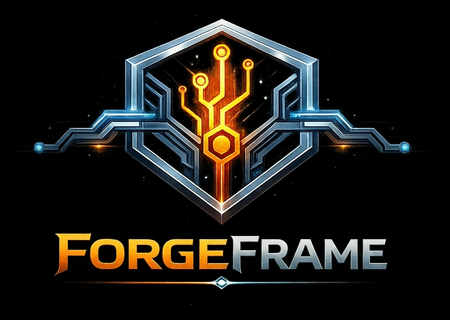

# ForgeFrame

<p align="center">
  
</p>

Linux-first runtime and control plane for operating autonomous AI instances.

## Overview

ForgeFrame provides the infrastructure layer for running AI instances under operator control. It integrates API gateway behaviour, execution routing, queueing, work interaction flows, and operational visibility into a single platform.

The project is under active development.

## Capabilities

- Runtime control plane for autonomous AI instances
- API gateway and execution routing
- Queue-based workload distribution
- PostgreSQL-backed state persistence
- React-based operator interface
- Linux-first deployment model
- Observability foundation and operational controls

## Tech Stack

| Component | Technology |
|---|---|
| Backend | Python 3.11+, FastAPI, Uvicorn, Pydantic 2, SQLAlchemy, Psycopg 3, httpx, transitions |
| Frontend | React 19, TypeScript 5.9, Vite 7, React Router 7, TanStack Query 5, TanStack Table 8, React Aria 3, Zustand 5, Tailwind CSS 4 |
| Database | PostgreSQL 14+ (primary), SQLite (limited/dev) |
| Platform | Linux |

## Requirements

- Linux (primary target)
- Python 3.11+
- Node.js 20+
- PostgreSQL 14+

## Installation

Use the unified installer:

```bash
git clone <your-repo-url>
cd ForgeFrame
./deploy/scripts/forgeframe-setup.sh
```

For full setup and deployment modes, see [docs/installation.md](docs/installation.md).

## Project Structure

```text
backend/     FastAPI services and domain logic
frontend/    React 19 SPA — operator interface
docs/        Technical and operations documentation
deploy/      Deployment assets (env, systemd, docker, scripts)
reference/   Architecture and design references
```

## Development

```bash
# Frontend
npm run dev         # Start Vite dev server
npm run typecheck   # TypeScript check
npm test            # Run frontend test suite
npm run build       # Production bundle

# Backend
pytest              # Run backend test suite
```

Run frontend commands from `frontend/` and backend commands from `backend/`.

## Documentation

Additional documentation is maintained in `docs/`:

- [Installation Guide](docs/installation.md) — local setup, installer modes, startup, and troubleshooting
- [Configuration Reference](docs/configuration.md) — env files, required variables, runtime/TLS/provider settings
- [Design Tokens & UI Guide](docs/frontend/UI-TOKENS.md) — colors, spacing, typography, dark/light theme
- [UX Review Mode](docs/frontend/ux-review-mode.md) — Dev-only UI inspection, annotation, and export tool for reviewers
- [Compactness Rules](docs/frontend/compactness-rules.md) — Layout density and visual-weight budget for operational pages
- [Residual UX Anti-Pattern Catalog](docs/frontend/residual-ux-anti-pattern-catalog.md) — Common UI issues across pages
- Generated TypeDoc: `cd frontend && npm run docs` → `docs/index.html`

Legacy reference (historical): `reference/README_OLD.md`
