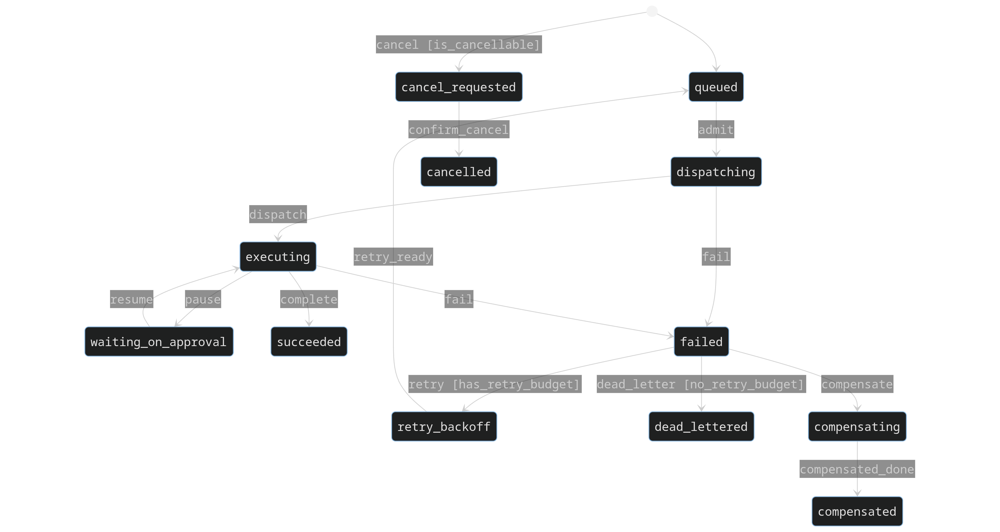

# EVA: Backend State Machine

**Project:** ForgeFrame  
**Date:** 2026-05-02  
**Author:** Agent Evaluation  
**Status:** Research & Recommendations  

---

## Table of Contents

1. [Executive Summary](#1-executive-summary)
2. [Current State Management Landscape](#2-current-state-management-landscape)
3. [Why Consider a Formal State Machine?](#3-why-consider-a-formal-state-machine)
4. [Library Comparison: `transitions` vs `python-statemachine`](#4-library-comparison-transitions-vs-python-statemachine)
5. [Module-by-Module Evaluation](#5-module-by-module-evaluation)
6. [Recommended Approach](#6-recommended-approach)
7. [Concrete Migration Examples](#7-concrete-migration-examples)
8. [Risks and Downsides](#8-risks-and-downsides)
9. [Decision Matrix](#9-decision-matrix)
10. [Recommendation](#10-recommendation)

---

## 1) Executive Summary

The ForgeFrame backend manages **15+ domain entities with lifecycle status fields**, ranging from simple 3-state enums to complex 13-state machines with orthogonal sub-states. **None use a formal state machine library.** Status transitions are enforced ad-hoc via inline `if`/`elif`/set-membership checks scattered across service methods.

The **execution module** (`execution/`) is the most complex: it maintains two parallel 13-state machines (`RunState` and `RunOperatorState`) with 18+ transition methods, each containing hand-written guard logic using manually curated state sets (`_TERMINAL_RUN_STATES`, `_CLAIMABLE_ATTEMPT_STATES`, etc.). This is where a formal state machine would deliver the most value.

**Key finding:** Introducing a state machine library would meaningfully reduce bugs, improve code clarity, and enforce correctness — but should be done **incrementally, starting with `execution/`**, not as a Big Bang rewrite.

### Decision

> **Proceed with `transitions` library for the `execution/` module only.**
> Evaluate after one sprint. Do not touch other modules yet.
> 
> **Rationale:** The execution module has the highest state complexity (13×13 states with orthogonal dimensions), the most transition methods (18+), and is explicitly listed as needing hardening in the project spec. It provides the highest ROI with manageable risk.

---

## 2) Current State Management Landscape

### 2.1 What Exists

Every domain module follows the same pattern:

```python
# 1. Define Literal type
RUN_STATES = ("queued", "dispatching", "executing", "waiting_on_approval", ...)
RunState = Literal["queued", "dispatching", "executing", ...]

# 2. Store as string column with CheckConstraint
RunORM.state: Mapped[str] = mapped_column(CheckConstraint("state IN (...)"))
RunRecord.state: RunState = "queued"

# 3. Validate transitions with ad-hoc guard sets
_TERMINAL_RUN_STATES = {"succeeded", "failed", "cancelled", ...}
_CLAIMABLE_ATTEMPT_STATES = {"queued", "retry_backoff"}

# 4. Check membership inline
if run.state in _TERMINAL_RUN_STATES:
    raise RunTransitionConflictError(...)
```

### 2.2 Problem Dimensions

| Problem | Impact | Example |
|---|---|---|
| **Manual guard sets drift** | Sets are maintained by hand; adding a new state means updating every guard set that should include it | Adding `"dead_lettered"` required updating `_TERMINAL_RUN_STATES`, `_RETRYABLE_RUN_STATES` independently |
| **No transition table** | Impossible to answer "what transitions are valid?" without reading every method | `RunState` has 13 states × 13 states = 169 possible transitions, but the actual valid set is undocumented |
| **Orphan state transitions** | Nothing prevents setting a state value that no transition method would produce | `RunRecord.state = "dispatching"` anywhere in code is valid Python |
| **Scattered validation** | Guard logic is duplicated across methods with slightly different checks | `request_cancel` checks `run.state in _TERMINAL_RUN_STATES or run.state == "cancel_requested"` while other methods check different sets |
| **No entry/exit actions** | Side effects (e.g., setting timestamps, emitting events) are embedded in transition methods, not attached to states | Cleanup on exit from `executing` must be manually called everywhere |

### 2.3 All Status Fields Across the Backend

| Domain | Status Literal | States | Complexity |
|---|---|---|---|
| **execution/** | `RunState` | 13 | HIGH |
| **execution/** | `RunOperatorState` | 13 | HIGH (orthogonal to RunState) |
| **execution/** | `RunAttemptState` | 13 | HIGH |
| **execution/** | `ExecutionWorkerState` | 6 | MEDIUM |
| **execution/** | `RunExternalCallStatus` | 6 | MEDIUM |
| **execution/** | `RunOutboxPublishState` | 4 | LOW |
| **tasks/** | `NotificationDeliveryStatus` | 11 | MEDIUM |
| **tasks/** | `ReminderStatus` | 5 | LOW |
| **approvals/** | `ApprovalStatus` | 5 | LOW |
| **approvals/** | `ApprovalSessionStatus` | 4 | LOW |
| **conversations/** | `ConversationStatus` | 4 | LOW |
| **conversations/** | `TriageStatus` | 5 | LOW |
| **conversations/** | `ConversationParticipantStatus` | 7 | LOW |
| **workspaces/** | `WorkspaceStatus` | 6 | LOW |
| **workspaces/** | `WorkspaceNextActionKey` | 7 | LOW |
| **skills/** | `SkillStatus` | 4 | LOW |
| **learning/** | `LearningStatus` | 4 | LOW |
| **agents/** | `AgentStatus` | 3 | LOW |

Total: **~17 domain entities with status fields, ~100+ discrete states.**

---

## 3) Why Consider a Formal State Machine?

### Benefits

| Benefit | Explanation |
|---|---|
| **Explicit transition table** | All valid transitions declared in one place — machine-readable, reviewable, testable |
| **Automatic guard enforcement** | Invalid transitions raise errors without custom if/elif chains |
| **Entry/exit callbacks** | Side effects (timestamps, outbox events, cleanup) attached to states, not scattered |
| **Visual diagram generation** | Graphviz/Mermaid output from `transitions` — documentation that never goes stale |
| **State querying** | `machine.is_state("executing")`, `machine.can_transition("cancel")`, `machine.get_triggers()` |
| **Reduced test surface** | Transition validity tests centralized; per-method edge case tests reduced |
| **Async support** | Both libraries support async callbacks (critical for the `asyncio`-based backend) |

### Downsides

| Downside | Mitigation |
|---|---|
| **New dependency** | `transitions` is 2.5k GitHub stars, stable API since 2014, zero transitive deps |
| **Learning curve** | The team must learn state machine concepts. Mitigation: start with one module, pair-program |
| **ORM integration friction** | State machines operate on Python objects, not DB rows. Must sync machine state ↔ DB state explicitly |
| **Migration cost** | Refactoring 18 existing transition methods takes effort. Mitigation: leave old code working, add state machine alongside, swap gradually |
| **Over-engineering risk** | For 3-state enums (agents, skills), a formal state machine is overkill. Mitigation: only apply where complexity justifies it |

---

## 4) Library Comparison: `transitions` vs `python-statemachine`

Researched via Context7 with live documentation and code examples.

| Aspect | `transitions` (`/pytransitions/transitions`) | `python-statemachine` (`/fgmacedo/python-statemachine`) |
|---|---|---|
| **GitHub Stars** | ~5.6k | ~1k |
| **Source Reputation** | Medium | High |
| **Code Snippets (Context7)** | 394 | 135 |
| **Benchmark Score** | 88.6 | — (not benchmarked) |
| **Python Support** | 2.7+ / 3.x | 3.8+ |
| **Async** | ✅ `AsyncMachine` extension | ✅ Native `async` methods |
| **Hierarchical states** | ✅ `HierarchicalMachine` extension | ❌ Not supported |
| **Guards (conditions)** | ✅ `conditions=` parameter | ✅ `cond=` parameter |
| **Entry/Exit callbacks** | ✅ `before=` / `after=` / `on_enter_` / `on_exit_` | ✅ `on_enter_` / `on_exit_` methods |
| **Diagram generation** | ✅ Graphviz + Mermaid | ❌ Not built-in |
| **Queued transitions** | ✅ Built-in queue processing | ❌ Not built-in |
| **Thread safety** | ✅ `LockedMachine` extension | ❌ Not built-in |
| **Model-based** | ✅ Attach machine to any object | ✅ Class-based DSL |
| **Transition table** | Explicit list of dicts | Decorator-based DSL |
| **Wildcard transitions** | ✅ `source='*'` | ❌ Must specify each source |
| **Auto transitions** | ✅ `add_ordered_transitions()` | ❌ Manual per transition |
| **Package size** | ~120KB, zero dependencies | ~80KB, zero dependencies |
| **API stability** | Stable since 2014 (v0.x) | Pre-1.0 (v2.x, API changes) |
| **Maintenance** | Active (last release 2025) | Active (last release 2025) |
| **Type hints** | Partial | Good |

### 4.1 Recommendation: `transitions`

**Why `transitions` wins for ForgeFrame:**

1. **Async support** — `AsyncMachine` integrates cleanly with FastAPI's async engine
2. **Hierarchical states** — `RunOperatorState` is essentially a substate concern; hierarchical machines could model this naturally
3. **Wildcard transitions** — Critical for cancel/error flows that should work from many states (`source='*'`)
4. **Queued transitions** — The execution engine processes commands sequentially; queued transitions prevent race conditions
5. **Model-based pattern** — Attach the state machine to existing ORM model objects, no class hierarchy change needed
6. **Diagram generation** — Graphviz output for documentation is a strong bonus
7. **Larger ecosystem** — More examples, more community experience, more battle-testing

---

## 5) Module-by-Module Evaluation

### 5.1 HIGH Priority: `execution/`

**Current state:** 2423-line `service.py` with 18+ transition methods, each containing 5-30 lines of hand-written guard logic. Two orthogonal 13-state machines (`RunState` and `RunOperatorState`) that must be kept in sync. Version-based optimistic concurrency. Outbox event emission tied to transitions.

**Why state machine helps:**
- Documents the 169 possible (RunState, RunOperatorState) combinations with a transition table
- Entry/exit callbacks naturally handle: outbox event emission, version bumping, timestamp setting
- Orthogonal state machines can be modeled as parallel regions or separate machines with coordination
- Guards can encapsulate the retry-budget check, lease validation, and approval gate conditions

**Migration strategy:**
1. Build a `RunStateMachine` class using `transitions.AsyncMachine` wrapping the existing `ExecutionTransitionService`
2. Run in parallel (dual-write validation) for one sprint
3. Replace old method bodies with delegation to the state machine
4. Remove old guard sets and inline validation

**Estimated effort:** 3-5 days for initial implementation + 1 sprint of parallel validation.

---

### 5.2 MEDIUM Priority: `tasks/` (notifications)

**Current state:** `NotificationDeliveryStatus` has 11 states with an 8-branch `_notification_evidence` if/elif chain. Timer-triggered transitions (scheduled → due).

**Why state machine helps:**
- Reminder/notification timing becomes `after('2h')` triggers
- Delivery pipeline becomes a linear state machine with clear terminal states
- Entry callbacks for "send notification" actions

**Estimated effort:** 1-2 days.

---

### 5.3 LOW Priority: remaining modules

| Module | Action | Rationale |
|---|---|---|
| **approvals/** | Defer | 5 states, simple transitions delegated to execution module |
| **conversations/** | Defer | 4-7 states each, no transition validation currently — adding any validation is improvement |
| **skills/** | Defer | 4 states, simple, no bug reports |
| **learning/** | Defer | Decision-driven, not state-driven. 4 states, mostly status tracking |
| **workspaces/** | Defer | 4 orthogonal status fields, little interaction |
| **agents/** | Defer | 3 states, trivial |
| **harness/** | Defer | Mostly wraps execution module |

**Rule of thumb:** If the module has ≤5 states and ≤3 transition methods, a formal state machine is not justified (KISS / Rule of Three).

---

## 6) Recommended Approach

### Phase 1: `execution/` Module (Current Sprint)

```
┌─────────────────────────────────────────────────────────┐
│  Phase 1a: Add transitions dependency + RunStateMachine  │
│  - pip install transitions                               │
│  - Create app/execution/state_machine.py                  │
│  - Define RunTransition enum + state machine config      │
│  - Add comprehensive unit tests                           │
│  - Generate Mermaid diagram → reference/                  │
├─────────────────────────────────────────────────────────┤
│  Phase 1b: Parallel validation (1 sprint)                │
│  - Both old and new transition paths execute              │
│  - Log mismatches as warnings (not errors)                │
│  - Fix discovered discrepancies                           │
├─────────────────────────────────────────────────────────┤
│  Phase 1c: Swap over                                     │
│  - Old guard sets removed                                │
│  - ExecutionTransitionService delegates to state machine  │
│  - Old _TERMINAL_RUN_STATES etc. removed                 │
└─────────────────────────────────────────────────────────┘
```

### Phase 2: Evaluate After One Sprint

After running Phase 1 for one sprint, evaluate:

- How many bugs did the state machine catch?
- How much test code was eliminated?
- Was the developer experience better or worse?
- Were there any performance regressions?
- Is the team comfortable with the library?

Based on this evaluation, decide whether to expand to Phase 3 or stop.

### Phase 3: `tasks/` Notifications (Next Sprint)

Only proceed if Phase 1 evaluation is positive.

### Never Phase: Leave other modules as-is

Skills, agents, approvals, conversations, learning, workspaces — these do not justify formal state machines. Simple enum + guard patterns are appropriate for 3-5 state systems.

---

## 7) Concrete Migration Examples

### 7.1 Current Pattern (ad-hoc guards)

```python
# File: app/execution/service.py (lines 26-43)
_TERMINAL_RUN_STATES = {"succeeded", "failed", "cancelled", "timed_out", "compensated", "dead_lettered"}
_RETRYABLE_RUN_STATES = {"failed", "timed_out", "compensated", "dead_lettered"}
_IN_FLIGHT_ATTEMPT_STATES = {"dispatching", "executing", "cancel_requested", "compensating"}

def request_cancel(self, *, company_id, run_id, ...):
    run = session.get(RunORM, run_id)
    if run.state in _TERMINAL_RUN_STATES or run.state == "cancel_requested":
        raise RunTransitionConflictError(...)
    # ... 50 more lines of manual state management
```

### 7.2 Target Pattern (state machine)

```python
# File: app/execution/state_machine.py

from transitions.extensions.asyncio import AsyncMachine

class RunStateMachine:
    """Formal state machine for the execution Run lifecycle."""

    states = [
        "queued",
        "dispatching",
        "executing",
        "waiting_on_approval",
        "cancel_requested",
        "retry_backoff",
        "compensating",
        "succeeded",
        "failed",
        "cancelled",
        "timed_out",
        "compensated",
        "dead_lettered",
    ]

    transitions = [
        # Normal flow
        {"trigger": "admit",     "source": "queued",                "dest": "dispatching"},
        {"trigger": "dispatch",  "source": "dispatching",           "dest": "executing"},
        {"trigger": "pause",     "source": "executing",             "dest": "waiting_on_approval"},
        {"trigger": "resume",    "source": "waiting_on_approval",   "dest": "executing"},
        {"trigger": "complete",  "source": "executing",             "dest": "succeeded"},

        # Error paths
        {"trigger": "fail",      "source": ["dispatching", "executing"], "dest": "failed"},
        {"trigger": "time_out",  "source": ["dispatching", "executing", "retry_backoff"], "dest": "timed_out"},

        # Cancel: allowed from most non-terminal states
        {"trigger": "cancel",    "source": "*",                     "dest": "cancel_requested",
                                 "conditions": "is_cancellable"},

        # Retry
        {"trigger": "retry",     "source": ["failed", "timed_out"], "dest": "retry_backoff",
                                 "conditions": "has_retry_budget"},
        {"trigger": "retry_ready", "source": "retry_backoff",       "dest": "queued"},

        # Compensation
        {"trigger": "compensate","source": ["failed", "cancelled", "timed_out"], "dest": "compensating"},
        {"trigger": "compensated_done", "source": "compensating",   "dest": "compensated"},

        # Dead letter
        {"trigger": "dead_letter","source": ["failed", "timed_out", "compensated"], "dest": "dead_lettered"},
    ]

    def __init__(self, run_record, callback_context):
        self._run = run_record
        self._ctx = callback_context
        self.machine = AsyncMachine(
            model=self,
            states=self.states,
            transitions=self.transitions,
            initial=run_record.state,
            send_event=True,   # Callbacks receive event data
            auto_transitions=False,
            ignore_invalid_triggers=False,
        )

    # --- Guards ---
    def is_cancellable(self, event):
        return self.state not in _TERMINAL_RUN_STATES  # centralized!

    def has_retry_budget(self, event):
        return self._run.active_attempt_no <= self._ctx.max_attempts

    # --- Entry callbacks ---
    def on_enter_cancel_requested(self, event):
        self._run.cancel_requested_at = event.kwargs.get("now")
        self._ctx.emit_outbox("run_cancel")
        self._run.version += 1

    def on_enter_succeeded(self, event):
        self._run.terminal_at = event.kwargs.get("now")
        self._run.status_reason = None
        self._ctx.emit_outbox("run_complete")
        self._run.version += 1
```

### 7.3 Mermaid Output (generated from `transitions`)

A state machine diagram can be auto-generated and embedded in CI documentation:



---

## 8) Risks and Downsides

### 8.1 Technical Risks

| Risk | Likelihood | Impact | Mitigation |
|---|---|---|---|
| **ORM state desync** | Medium | High | Integrate state machine with DB transaction; use version field for optimistic locking |
| **Async callback errors** | Low | Medium | Wrap callbacks with error boundaries; log and re-raise as `RunTransitionConflictError` |
| **Performance regression** | Low | Low | `transitions` has ~1µs transition overhead; negligible compared to DB operations |
| **Race conditions** | Low | High | Queued transitions mode prevents callback re-entrance; combine with DB-level locking |

### 8.2 Process Risks

| Risk | Mitigation |
|---|---|
| **Over-engineering simple states** | Strict criteria: ≥6 states AND ≥5 transition methods → consider state machine |
| **Big Bang migration** | Forbidden by recommendation — always Phase 1 → evaluate → Phase 2 |
| **Team unfamiliarity** | Pair-program first state machine, document patterns, keep old code working during parallel validation |
| **Library abandonment** | `transitions` has 11+ years of stable API; no breaking changes expected. Worst case: the explicit transition table is still valuable documentation and can be re-implemented |

### 8.3 When NOT to Use a State Machine

- 2-5 simple states with no explicit transition validation (e.g., `AgentStatus`)
- Purely informational status (e.g., `SkillActivationStatus`)
- Status that is set once and never changes (e.g., `ArtifactStatus` → `archived`)
- Status derived from other fields (e.g., `LearningReviewBucket`)

---

## 9) Decision Matrix

| Criterion | `transitions` | `python-statemachine` | Keep ad-hoc |
|---|---|---|---|
| Explicit transition table | ✅ | ✅ | ❌ |
| Async callback support | ✅ | ✅ | N/A |
| Hierarchical states | ✅ | ❌ | N/A |
| Wildcard transitions | ✅ | ❌ | N/A |
| Diagram generation | ✅ Graphviz + Mermaid | ❌ | N/A |
| Zero dependencies | ✅ (library is ~120KB) | ✅ | ✅ |
| Trust/API stability | ⭐⭐⭐⭐ (11 years) | ⭐⭐ (pre-1.0, API churn) | ⭐⭐⭐⭐⭐ |
| Foreign-key to ORM pattern | ✅ attach to model | ❌ class-based only | N/A |
| Migration effort (execution) | 3-5 days | 5-7 days | 0 days |
| Bug prevention | HIGH | HIGH | LOW |
| Test surface reduction | HIGH | HIGH | baseline |
| Documentation value | HIGH (auto-generated) | MEDIUM (manual) | LOW (manual) |

---

## 10) Recommendation

### Proceed — with `transitions`, for `execution/` only, incrementally.

**Why now?** The project's own spec (§12 P0) lists "Execution Engine Hardening — run state transitions, error recovery, operator commands" as a current priority. Introducing a state machine directly serves this goal. The `execution/` module is:

1. The **most complex** state management in the codebase (13×13 states, 18+ transitions)
2. The **most critical** for correctness (financial impact of incorrect run status)
3. Already identified as needing **hardening** in the project spec
4. The **highest ROI** — one module that validates the approach for all future decisions

**Do not** apply state machines to low-complexity modules (skills, agents, approvals, conversations, learning, workspaces). Their current enum + if/elif patterns are appropriate.

### Concrete Next Steps

```
1. pip install transitions
2. Create app/execution/state_machine.py with RunStateMachine (see §7.2)
3. Add test_execution_state_machine.py — test every transition, every guard
4. Add dual-validation logging to ExecutionTransitionService
5. Run in parallel for one sprint
6. Evaluate: bugs caught? tests simplified? team feedback?
7. If positive: retire old guard sets, delegate entirely to state machine
8. Generate diagram → reference/execution_state_diagram.md
9. Consider Phase 2 (tasks/ notifications) based on evaluation
```

### File Change Summary (Phase 1)

| File | Action |
|---|---|
| `backend/pyproject.toml` | Add `transitions` to dependencies |
| `backend/app/execution/state_machine.py` | CREATE — RunStateMachine + RunOperatorMachine |
| `backend/app/execution/service.py` | MODIFY — add dual-validation logging to each transition method |
| `backend/tests/test_execution_state_machine.py` | CREATE — comprehensive transition tests |
| `reference/execution_state_diagram.md` | CREATE — auto-generated Mermaid diagram |
| All other files | NO CHANGE — not touching other modules |
