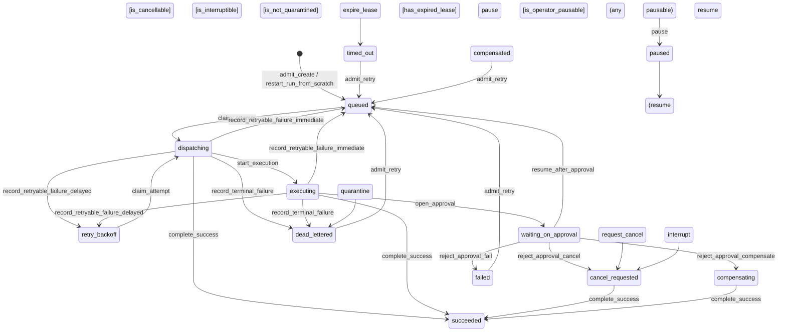

# ForgeFrame Execution State Machine — Mermaid Diagram

**Source:** Generated from `backend/app/execution/state_machine.py` transition/effect constants.
**Library:** `pytransitions/transitions` machine tables.
**Requires:** No Graphviz, pygraphviz, or system packages.

---

## Run-State Machine (`stateDiagram-v2`)

---

## Operator-State Machine

The operator-state machine operates orthogonally on the same adapter model
using `model_attribute="operator_state"`. It handles only two triggers:

| Trigger   | Source              | Destination        | Guard                   |
|-----------|---------------------|--------------------|-------------------------|
| `pause`   | `*` (any pausable)  | `paused`           | `is_operator_pausable`  |
| `resume`  | `paused`            | mapped per run state | `is_operator_resumable` |

### `pause` guard (`is_operator_pausable`)

- Operator state must not be terminal (`completed`, `quarantined`, `failed`).
- Operator state must not already be `paused`.

### `resume` guard (`is_operator_resumable`)

- Operator state must be `paused`.
- No open approval link exists.
- No current approval link ID.

### Resume target mapping

Target operator state is looked up from `RUN_TO_OPERATOR_RESUME_MAP` by current run state:

| Run state             | Resume target |
|-----------------------|---------------|
| `queued`              | `admitted`    |
| `dispatching`         | `leased`      |
| `executing`           | `waiting_external` |
| `waiting_on_approval` | `waiting_on_approval` |
| `cancel_requested`    | `cancel_requested` |
| `retry_backoff`       | `retry_scheduled` |
| `compensating`        | `compensating` |
| `succeeded`           | `completed`   |
| `failed`              | `failed`      |
| `dead_lettered`       | `quarantined` |
| `timed_out`           | `admitted` (fallback) |
| `cancelled`           | `admitted` (fallback) |
| `compensated`         | `admitted` (fallback) |

---

## Trigger-Aware Run/Operator Coordination

Each run-state trigger maps to a `(target_run_state, [valid_operator_states])` tuple:

| Trigger | Target run state | Valid operator state(s) |
|---|---|---|
| `claim_attempt` | `dispatching` | `leased` |
| `start_execution` | `executing` | `executing`, `waiting_external` |
| `open_approval` | `waiting_on_approval` | `waiting_on_approval` |
| `resume_after_approval` | `queued` | `admitted` |
| `reject_approval_cancel` | `cancel_requested` | `cancel_requested` |
| `reject_approval_compensate` | `compensating` | `compensating` |
| `reject_approval_fail` | `failed` | `failed` |
| `complete_success` | `succeeded` | `completed` |
| `record_retryable_failure_delayed` | `retry_backoff` | `retry_scheduled` |
| `record_retryable_failure_immediate` | `queued` | `admitted` |
| `record_terminal_failure` | `dead_lettered` | `quarantined` |
| `request_cancel` | `cancel_requested` | `cancel_requested` |
| `admit_retry` | `queued` | `admitted` |
| `interrupt` | `cancel_requested` | `interrupted` |
| `quarantine` | `dead_lettered` | `quarantined` |
| `expire_lease` | `timed_out` | `quarantined` |

---

## Attempt Effects (SPEC §6.4)

Each trigger has expected attempt-state, attempt-operator-state, and lease-status outcomes:

| Trigger | Source attempt | Replacement attempt | Lease |
|---|---|---|---|
| `claim_attempt` | → `dispatching` / `leased` | — | `leased` |
| `start_execution` | → `executing` / *chosen* | — | `leased` |
| `open_approval` | → `waiting_on_approval` / `waiting_on_approval` | — | `released` |
| `resume_after_approval` | → `queued` / `admitted` | — | `released` |
| `reject_approval_cancel` | → `cancel_requested` / `cancel_requested` | — | *unchanged* |
| `reject_approval_compensate` | → `compensating` / `compensating` | — | *unchanged* |
| `reject_approval_fail` | → `failed` / `failed` | — | *unchanged* |
| `complete_success` | → `succeeded` / `completed` | — | `released` |
| `record_retryable_failure_delayed` | → `failed` / `failed` | → `retry_backoff` / `retry_scheduled` | `released` |
| `record_retryable_failure_immediate` | → `failed` / `failed` | → `queued` / `admitted` | `released` |
| `record_terminal_failure` | → `dead_lettered` / `quarantined` | — | `released` |
| `request_cancel` | → `cancel_requested` / `cancel_requested` | — | *unchanged* |
| `admit_retry` | *unchanged* | → `queued` / `admitted` | *unchanged* |
| `interrupt` | → `cancel_requested` / `interrupted` | — | `released` |
| `quarantine` | → `dead_lettered` / `quarantined` | — | `released` |
| `expire_lease` | → `timed_out` / `interrupted` | — | `expired` |
| `pause` | *unchanged* / → `paused` | — | *unchanged* |
| `resume` | *unchanged* / → *mapped* | — | *unchanged* |

---

## Run States

| State | Category | Notes |
|---|---|---|
| `queued` | active | Initial state on create |
| `dispatching` | active | Claimed, awaiting worker |
| `executing` | active | Worker is executing |
| `waiting_on_approval` | blocked | Awaiting approval decision |
| `cancel_requested` | active/terminal-pending | Cancel initiated |
| `retry_backoff` | delayed | Waiting for retry schedule |
| `compensating` | active cleanup | Compensation in progress |
| `succeeded` | **terminal** | Success |
| `failed` | **terminal** | Terminal failure (retryable) |
| `cancelled` | **terminal** | Declared, currently unreached |
| `timed_out` | **terminal** | Lease expired |
| `compensated` | **terminal** | Declared, currently unreached |
| `dead_lettered` | **terminal** | Non-retryable / budget exhausted |

---

## Operator States

| State | Category |
|---|---|
| `admitted` | active |
| `leased` | active |
| `executing` | active |
| `waiting_external` | active |
| `waiting_on_approval` | active |
| `paused` | paused |
| `interrupted` | interrupted |
| `retry_scheduled` | scheduled |
| `completed` | **terminal** |
| `quarantined` | **terminal** |
| `failed` | **terminal** |
| `cancel_requested` | active |
| `compensating` | active |

---

## Guard Reference (SPEC §8.2)

| Guard | Attached to | Condition |
|---|---|---|
| `is_claimable_run` | `claim_attempt` | `run_state ∈ {queued, retry_backoff}` |
| `is_claimable_attempt` | `claim_attempt` | attempt state = queued/retry_backoff, operator = admitted/retry_scheduled |
| `is_claimable_wakeup_due` | `claim_attempt` | `scheduled_at ≤ now` or no schedule |
| `is_not_paused` | `start_execution` | operator ≠ paused |
| `is_executing` | `open_approval` | run + attempt = executing |
| `has_open_approval_gate` | `resume_after_approval`, `reject_approval_*` | approval gate = open |
| `is_waiting_on_approval` | approval decisions | run + attempt = waiting_on_approval |
| `is_current_attempt` | lease/approval triggers | attempt_id = current_attempt_id |
| `is_in_flight_attempt` | `complete_success`, `expire_lease` | attempt ∈ {dispatching, executing, cancel_requested, compensating} |
| `is_recordable_failure` | `record_retryable_failure_*`, `record_terminal_failure` | run + attempt ∈ {dispatching, executing} |
| `is_cancellable_run` | `request_cancel` | run ∉ terminal states AND ≠ cancel_requested |
| `is_retryable_run` | `admit_retry` | run ∈ {failed, timed_out, compensated, dead_lettered} |
| `is_retryable_and_has_budget` | `record_retryable_failure_*` | retryable AND active_attempt_no + 1 ≤ max_attempts |
| `is_terminal_failure_destination` | `record_terminal_failure` | NOT retryable OR budget exhausted |
| `has_valid_lease_token` | `start_execution`, `complete_success`, `record_*` | tokens match |
| `has_expired_lease` | `expire_lease` | lease_status=leased AND lease_expires_at < now |
| `is_not_quarantined` | `quarantine` | operator_state ≠ quarantined |
| `is_operator_pausable` | `pause` | operator ∉ terminal AND ≠ paused |
| `is_operator_resumable` | `resume` | operator = paused AND no open approval |
| `is_interruptible` | `interrupt` | operator ∉ terminal |
| `is_valid_service_chosen_operator_state` | `start_execution`, retry, `resume` | chosen state ∈ trigger's valid target set |
